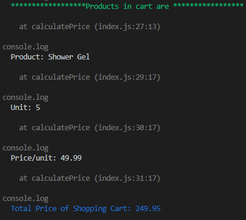

# Shopping cart & Calculate its Total price

The solution is to add items to shopping cart and calculate the sales tax and then total price. 

**Language** : Javascript/nodejs
**Test Coverage**: The solution covers unit tests

**Build file**: run.sh

This solution is test driven and the test cases are written for,

**Step 1:** **Add products to the shopping cart**.

**Given**:

An empty shopping cart

And a product, Shower Gel with a unit price of 49.99

**When**:

The user adds 5 Shower Gels to the shopping cart

**Then**:

The shopping cart should contain 5 Shower Gels each with a unit price of 49.99

And the shopping cart’s total price should equal 249.95

**Step 2: Add additional products of the same type to the shopping cart.**

**Given**:

An empty shopping cart

And a product, Shower Gel with a unit price of 49.99

**When**:

The user adds 5 Shower Gel to the shopping cart

And then adds another 3 Shower Gel to the shopping cart

**Then**:

The shopping cart should contain 8 Shower Gels each with a unit price of 49.99

And the shopping cart’s total price should equal 399.92

**Step 3: Calculate the tax rate of the shopping cart with multiple items**

**Given**:

An empty shopping cart

And a product, Shower Gel with a unit price of 49.99

And another product, Deodorant with a unit price of 99.99

And a sales tax rate of 12.5%

**When**:

The user adds 2 Shower Gels to the shopping cart

And then adds 2 Deodorant to the shopping cart

**Then**:

The shopping cart should contain 2 Shower Gels each with a unit price of 49.99

And the shopping cart should contain 2 Deodorant each with a unit price of 99.99

And the total sales tax amount for the shopping cart should equal 37.50

And the shopping cart’s total price should equal 337.46

#### Prerequisite to run this program, 

* 'git' set up to clone the repository

* 'NodeJS' installed to run the program 

  

#### Steps to execute the program:

1. go to command prompt (WSL/ Linux)

2. **git clone git@github.com:kalyaniarikati/shoppingcart.git** 

   ​	- clones git repo into the local environment

3. **cd shoppingcart**

   ​	- go to project directory

4. **./run.sh** 

   ​	- installs dependency packages and triggers the test script.

 

